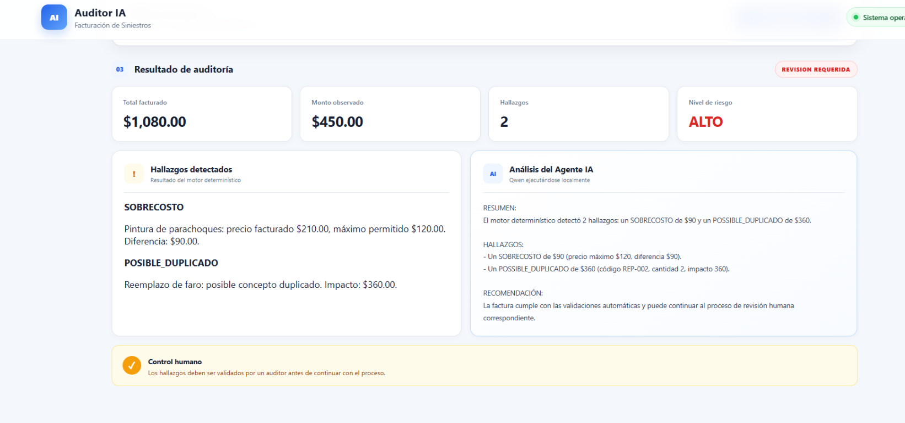
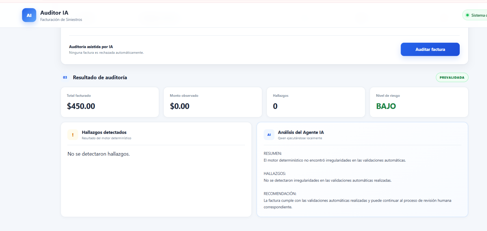

# Pruebas funcionales

## Auditor Agéntico de Facturación de Siniestros

Este documento registra las pruebas funcionales realizadas sobre el prototipo desarrollado para el HackIAthon.

El objetivo de las pruebas es comprobar que el motor determinístico puede identificar inconsistencias en la facturación y que el agente de IA puede explicar los resultados sin modificar los cálculos ni tomar decisiones de autorización o rechazo.

---

## Caso de prueba 01 — Factura con hallazgos

### Datos evaluados

- Total facturado: $1,080.00
- Conceptos facturados: 4
- Se incluyó un precio superior al tarifario.
- Se incluyó un concepto repetido para simular un posible duplicado.

### Resultado esperado

El sistema debe identificar:

- SOBRECOSTO
- POSIBLE_DUPLICADO
- Estado: REVISION_REQUERIDA
- Riesgo: ALTO
- Revisión humana requerida

### Resultado obtenido

- Total facturado: $1,080.00
- Monto observado: $450.00
- Cantidad de hallazgos: 2
- Sobrecosto detectado: $90.00
- Posible duplicado: $360.00
- Estado: REVISION_REQUERIDA
- Riesgo: ALTO

El agente de IA explicó los resultados producidos por el motor determinístico sin modificar los montos calculados.

### Evidencia

---

## Caso de prueba 02 — Factura sin hallazgos

### Datos evaluados

Se modificaron los conceptos de la factura para mantenerlos dentro del tarifario y eliminar posibles duplicados.

### Resultado esperado

El sistema no debe generar observaciones y la factura debe quedar prevalidada.

### Resultado obtenido

- Total facturado: $450.00
- Monto observado: $0.00
- Cantidad de hallazgos: 0
- Estado: PREVALIDADA
- Riesgo: BAJO

El motor determinístico no detectó hallazgos y el agente de IA generó una explicación consistente con ese resultado.

### Evidencia

---

## Validación del componente de IA

El modelo de lenguaje se utiliza exclusivamente para explicar los resultados obtenidos por el motor determinístico.

El agente tiene instrucciones para:

- No recalcular montos.
- No modificar la clasificación de riesgo.
- No inventar irregularidades.
- No afirmar que existe fraude.
- No autorizar ni rechazar pagos.
- Mantener los posibles duplicados sujetos a validación humana.

Esto permite separar las reglas de negocio y los cálculos determinísticos de la interpretación realizada mediante IA.

---

## Resultado general

Las pruebas realizadas validaron los dos escenarios principales del prototipo:

**Factura con inconsistencias → revisión humana requerida.**

**Factura sin inconsistencias detectadas → prevalidación.**

En ambos escenarios la decisión final permanece bajo control humano.

